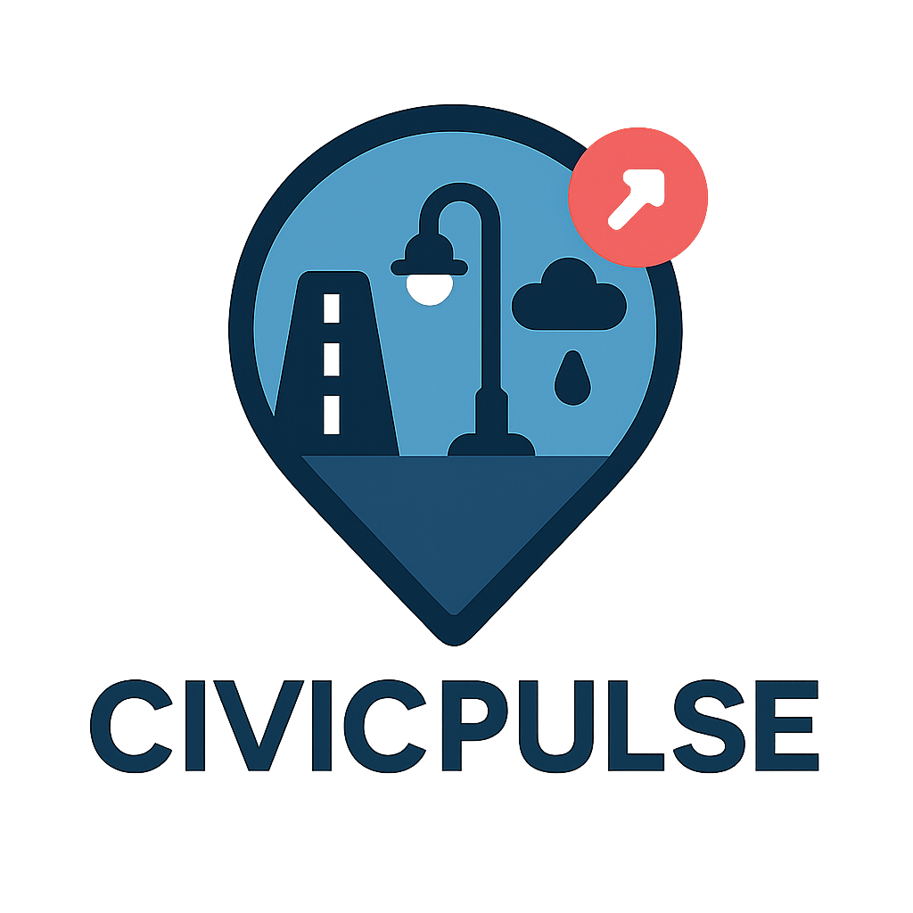

<div align="center">

<br/>



<br/>

```
 ██████╗██╗██╗   ██╗██╗ ██████╗    ██████╗ ██╗   ██╗██╗     ███████╗███████╗
██╔════╝██║██║   ██║██║██╔════╝    ██╔══██╗██║   ██║██║     ██╔════╝██╔════╝
██║     ██║██║   ██║██║██║         ██████╔╝██║   ██║██║     ███████╗█████╗  
██║     ██║╚██╗ ██╔╝██║██║         ██╔═══╝ ██║   ██║██║     ╚════██║██╔══╝  
╚██████╗██║ ╚████╔╝ ██║╚██████╗    ██║     ╚██████╔╝███████╗███████║███████╗
 ╚═════╝╚═╝  ╚═══╝  ╚═╝ ╚═════╝   ╚═╝      ╚═════╝ ╚══════╝╚══════╝╚══════╝
```

### *Your City · Your Voice · Your Change*

<br/>

[](https://developer.mozilla.org/en-US/docs/Web/HTML)
[](https://developer.mozilla.org/en-US/docs/Web/CSS)
[](https://developer.mozilla.org/en-US/docs/Web/JavaScript)
[](https://developers.google.com/maps)
[](LICENSE)

<br/>

[](https://Shahnawaz9493.github.io/civic_pulse/)
[](../../issues)
[](../../issues)

<br/>

> **Zero dependencies · Zero build steps · Zero excuses** — just open and go.

<br/>

</div>

---

## 🖼️ Screenshots

<div align="center">

<table>
  <tr>
    <td align="center" width="50%">
      
      <br/><br/><b>🏠 Home Dashboard</b>
    </td>
    <td align="center" width="50%">
      
      <br/><br/><b>📝 Issue Reporting</b>
    </td>
  </tr>
  <tr>
    <td align="center" width="50%">
      
      <br/><br/><b>🔍 Issue Tracking</b>
    </td>
    <td align="center" width="50%">
      
      <br/><br/><b>📊 Live Dashboard</b>
    </td>
  </tr>
  <tr>
    <td align="center" width="50%">
      
      <br/><br/><b>🕵️ Agent Dashboard</b>
    </td>
    <td align="center" width="50%">
      
      <br/><br/><b>👷 Find Workers</b>
    </td>
  </tr>
</table>

</div>

---

## 💡 The Problem We Solve

<div align="center">

| ❌ Before CivicPulse | ✅ With CivicPulse |
|:---|:---|
| Call a helpline, wait on hold forever | Report in seconds from any device |
| Email into the void, never hear back | Track every update in real-time |
| No way to gauge community impact | Upvote to escalate urgent issues |
| No accountability for resolution | Full lifecycle audit trail per issue |
| Language barriers for many citizens | Native support in 5 Indian languages |

</div>

> *Potholes ignored. Streetlights dark for months. Illegal dumping with no response.*
> **CivicPulse puts the power back in citizens' hands.**

---

## ✨ Features at a Glance

<details open>
<summary><b>🗺️ &nbsp;Smart Issue Reporting</b></summary>
<br/>

- Submit issues with title, description, category, and precise **GPS coordinates**
- Interactive **Google Maps** — search by address or tap to drop a pin anywhere
- Optional **photo upload** to attach visual evidence to your report
- Instant **unique Issue ID** generated on submission for easy tracking

<br/>
</details>

<details open>
<summary><b>📊 &nbsp;Live Issue Dashboard</b></summary>
<br/>

- All community issues displayed in a responsive card grid
- **Filter by category:** `Infrastructure` · `Safety` · `Environment` · `Transportation` · `Utilities`
- **Filter by status:** `Open` → `In Progress` → `Resolved`
- **Sort** by Newest, Oldest, or Most Upvoted

<br/>
</details>

<details open>
<summary><b>🔍 &nbsp;Real-Time Issue Tracking</b></summary>
<br/>

- Enter any Issue ID to track its full resolution lifecycle
- Visual **progress stepper** showing exactly where an issue stands
- Status updates reflected instantly as agents take action

<br/>
</details>

<details open>
<summary><b>🕵️ &nbsp;Agent Dashboard</b></summary>
<br/>

- Dedicated portal for civic agents and municipal authority personnel
- Manage, assign, and update issue statuses from a single unified view
- Streamlined workflow built for speed and accountability

<br/>
</details>

<details open>
<summary><b>👷 &nbsp;Find Workers</b></summary>
<br/>

- Browse **verified local service workers** by skill and availability
- Built-in **worker registration** portal
- Directly links citizen reports to on-ground resolution teams

<br/>
</details>

<details open>
<summary><b>💬 &nbsp;Community Interaction</b></summary>
<br/>

- **Upvote** issues to signal urgency to authorities
- **Comment** on issues to share updates or add context
- **Reviews page** for transparent, community-driven feedback

<br/>
</details>

<details open>
<summary><b>🌐 &nbsp;Multilingual Support</b></summary>
<br/>

Built for India's diverse communities — switch languages instantly:

| Flag | Language | Code |
|:---:|:---|:---:|
| 🇬🇧 | English | `en` |
| 🇮🇳 | Hindi — हिंदी | `hi` |
| 🇮🇳 | Telugu — తెలుగు | `te` |
| 🇮🇳 | Tamil — தமிழ் | `ta` |
| 🇮🇳 | Kannada — ಕನ್ನಡ | `kn` |

<br/>
</details>

<details open>
<summary><b>🤖 &nbsp;AI Chatbot Assistant</b></summary>
<br/>

- Floating **CivicPulse Assistant** available on every page
- Helps users navigate the platform, submit issues, or find information instantly

<br/>
</details>

<details open>
<summary><b>🔐 &nbsp;User Authentication</b></summary>
<br/>

- Full **Login / Register** flow with client-side validation
- Sign up via email or phone number
- Session-aware UI — profile icon, protected routes, logout

<br/>
</details>

---

## 🛠️ Tech Stack

<div align="center">

> *No frameworks. No bundlers. No `node_modules`. Just the web platform — used well.*

<br/>

| Technology | Role |
|:---|:---|
|  **HTML5** | Semantic structure, ARIA accessibility, modals, forms |
|  **CSS3** | Mobile-first responsive layout, CSS variables, animations |
|  **Vanilla JavaScript** | Routing, CRUD, state management, DOM manipulation |
|  **Google Maps JS API** | Interactive maps, coordinate picking |
|  **Google Places API** | Address autocomplete |
|  **LocalStorage API** | Client-side persistent data storage |

</div>

---

## ⚡ Quick Start

### `Step 1` — Clone the repo

```bash
git clone https://github.com/Shahnawaz9493/civic_pulse.git
cd civic_pulse
```

### `Step 2` — Add your Google Maps API Key

1. Go to [Google Cloud Console](https://console.cloud.google.com/)
2. Enable **Maps JavaScript API** and **Places API**
3. Create an API Key under **Credentials**
4. Replace the placeholder in `index.html`:

```html
<script
  src="https://maps.googleapis.com/maps/api/js?key=YOUR_API_KEY&libraries=places"
  async defer>
</script>
```

> 🔒 **Pro tip:** Restrict your API key to your domain in the Cloud Console before deploying to production.

### `Step 3` — Run it

```bash
# ✅ Option A — Just open directly (simplest)
open index.html

# ✅ Option B — Local dev server via npx (recommended)
npx serve .

# ✅ Option C — Python server
python -m http.server 8080
```

<div align="center">

**No `npm install`. No `webpack`. No `.env`. It just works. ✅**

</div>

---

## 📁 Project Structure

```
civic_pulse/
│
├── 📄  index.html    ←  App shell: all pages, modals & navigation
├── 🎨  styles.css    ←  Complete styling: responsive, animated, themed
├── ⚙️   script.js    ←  All logic: routing, CRUD, maps, auth, i18n
├── 📁  assets/       ←  Logo and static assets
└── 📖  README.md     ←  You are here
```

---

## 🗄️ Data Schema

Issues are stored in `localStorage` using this structure:

```jsonc
{
  "id":          "uuid-v4",
  "title":       "Broken streetlight on MG Road",
  "description": "Has been dark for 3 weeks near the bus stop.",
  "category":    "infrastructure",  // infrastructure | safety | environment | transportation | utilities | other
  "status":      "open",            // open | in-progress | resolved
  "location":    "MG Road, Bengaluru",
  "lat":         12.9716,
  "lng":         77.5946,
  "image":       "base64 | null",
  "upvotes":     14,
  "upvotedBy":   ["user-id-1"],
  "comments": [
    { "id": "cmt-1", "text": "Still dark tonight!", "date": "2025-04-10T08:00:00Z" }
  ],
  "createdAt":   "2025-04-01T10:00:00Z",
  "updatedAt":   "2025-04-10T08:30:00Z"
}
```

---

## 🎨 Customization Guide

### Theme Colors

Tweak the entire app's look by editing these CSS variables in `styles.css`:

```css
:root {
  --primary-color:    #2563eb;  /* Brand blue      */
  --secondary-color:  #10b981;  /* Success green   */
  --accent-color:     #f59e0b;  /* Warning amber   */
  --danger-color:     #ef4444;  /* Error red       */
  --bg-color:         #f8fafc;  /* Page background */
}
```

### Add a Category

1. Add an `<option>` to the category `<select>` in `index.html`
2. Update the `categoryLabels` object in `script.js`

### Add a Language

1. Add an `<option>` to the language `<select>` in `index.html`
2. Add your translation keys to the `translations` object in `script.js`

---

## ♿ Accessibility

<div align="center">

| Feature | Status |
|:---|:---:|
| Semantic HTML5 elements | ✅ |
| ARIA roles & labels | ✅ |
| Full keyboard navigation | ✅ |
| Focus management on modals | ✅ |
| Screen reader compatibility | ✅ |
| `prefers-reduced-motion` support | ✅ |
| Sufficient color contrast (WCAG AA) | ✅ |

</div>

---

## 🛣️ Roadmap

```
Phase 1 — Foundation          [✅ Complete]
Phase 2 — Backend & Cloud     [🔄 In Progress]
Phase 3 — Notifications       [📋 Planned]
Phase 4 — Analytics & PWA     [📋 Planned]
```

| Priority | Feature | Status |
|:---:|:---|:---:|
| 🔥 | Backend API (Node.js / Firebase / Supabase) | `Planned` |
| 🔥 | Email & SMS notifications on status change | `Planned` |
| ⚡ | Cloud image storage (Cloudinary / AWS S3) | `Planned` |
| ⚡ | Full-text issue search | `Planned` |
| 🌱 | Export to PDF / CSV | `Planned` |
| 🌱 | Issue density heatmap | `Planned` |
| 🌱 | PWA — installable on mobile | `Planned` |
| 🌱 | Push notifications | `Planned` |
| 🌱 | Authority analytics dashboard | `Planned` |
| 🌍 | More Indian regional languages | `Planned` |

---

## 🤝 Contributing

All contributions are welcome — big or small!

```bash
# 1. Fork the repo & clone your fork
git clone https://github.com/your-username/civic_pulse.git

# 2. Create a feature branch
git checkout -b feature/your-feature-name

# 3. Make your changes, then commit
git commit -m "feat: describe your change"

# 4. Push and open a Pull Request
git push origin feature/your-feature-name
```

Please make sure your code is clean, well-commented, and tested before opening a PR. Check open [Issues](../../issues) for things that need help!

---

## 🙌 Acknowledgements

- [**Google Maps Platform**](https://developers.google.com/maps) — for making location effortless
- [**MDN Web Docs**](https://developer.mozilla.org/) — the ultimate reference for the web platform
- Every developer who believes technology should serve communities, not just companies 🌍

---

## 📄 License

Distributed under the **MIT License** — free to use, modify, and share.
See [`LICENSE`](LICENSE) for full details.

---

<div align="center">

<br/>


<br/>

**Made with ❤️ for every city, every citizen, every complaint that deserves an answer.**

<br/>

*Found this useful? Drop a ⭐ — it means the world and helps others discover it!*

<br/>

[](../../stargazers)
&nbsp;&nbsp;&nbsp;
[](../../forks)
&nbsp;&nbsp;&nbsp;
[](../../issues)

<br/><br/>

</div>
